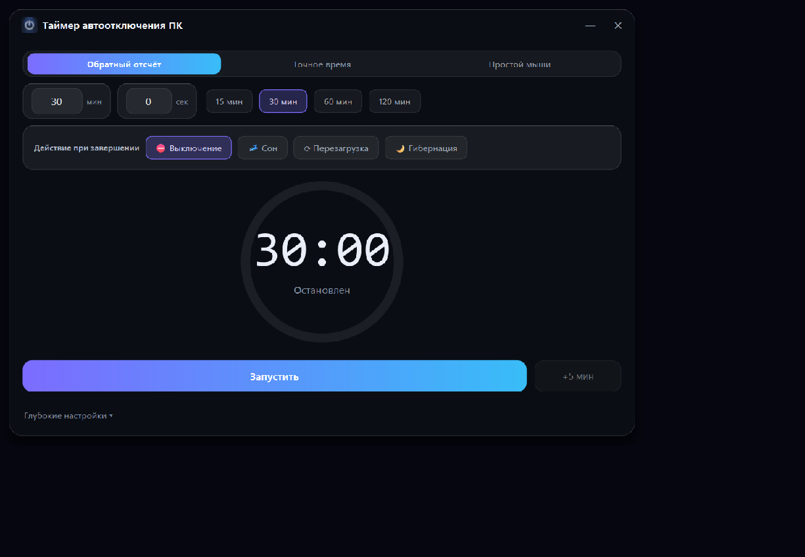
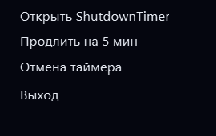

# ShutdownTimer — Таймер автоотключения ПК

[](LICENSE)
[](https://www.microsoft.com/windows)
[](https://github.com/R3G1ST/ShutdownTimer/releases)

Настольная утилита для Windows, которая автоматически выключает, засыпает, перезагружает или уходит в гибернацию ваш ПК по расписанию. Три режима таймера, четыре действия, системный трей, всплывающие уведомления с кнопкой продления, плавающий мини-виджет и автозагрузка — всё в одном компактном приложении с тёмной темой Dark Glassmorphism / Fluent Design 2.

## Возможности

- **3 режима таймера** — обратный отсчёт (минуты/секунды с пресетами), точное время срабатывания (HH:MM) и режим простоя (N минут бездействия мыши/клавиатуры).
- **4 действия при завершении** — выключение, сон, перезагрузка, гибернация.
- **Системный трей** — приложение сворачивается в трей, меню трея даёт быстрый доступ к старту, стопу и продлению.
- **Windows-уведомления (Toast)** — всплывающее уведомление с кнопкой продления «+5 мин» прямо из центра уведомлений.
- **Плавающий мини-виджет** — компактный виджет поверх всех окон: перетаскивание, пауза и отмена в один клик.
- **Автозагрузка** — запуск вместе со Windows (опция инсталлятора и настройка в приложении).
- **Инсталлятор** — Inno Setup: ярлыки на рабочем столе и в меню «Пуск», автозапуск.

## Скриншоты

| | |
|:--:|:--:|
| <br>**Главное окно** | <br>**Плавающий мини-виджет** |
| <br>**Меню трея** | <br>**Экран завершения с кнопкой отмены** |

## Установка

1. Откройте страницу релизов: **[github.com/R3G1ST/ShutdownTimer/releases/latest](https://github.com/R3G1ST/ShutdownTimer/releases/latest)** и скачайте файл `Setup.exe`.
2. Или напрямую: **[ShutdownTimer-Setup-1.0.0.exe](https://github.com/R3G1ST/ShutdownTimer/releases/download/v1.0.0/ShutdownTimer-Setup-1.0.0.exe)**.
3. Запустите инсталлятор и следуйте подсказкам.

Опции инсталлятора:

- создание ярлыка на рабочем столе;
- создание ярлыка в меню «Пуск»;
- автозапуск при входе в Windows.

## Использование

### Режимы таймера

- **Обратный отсчёт** — задайте минуты и секунды до срабатывания или выберите один из пресетов (15/30/45/60 минут и т. д.).
- **Точное время** — укажите время срабатывания в формате `HH:MM`; таймер посчитает, сколько осталось, и запустится сам.
- **Простой** — срабатывание начнётся после `N` минут без активности мыши и клавиатуры.

### Действие и управление

1. Выберите действие: **Выключение**, **Сон**, **Перезагрузка** или **Гибернация**.
2. Нажмите **Старт** — таймер пойдёт, **Стоп** — отменяет обратный отсчёт.
3. За минуту до срабатывания (и после него) появляется уведомление с кнопкой **«+5 мин»** — продлить на 5 минут можно из уведомления, из меню трея или из мини-виджета.

### Мини-виджет

- Перетаскивается за любую точку, всегда поверх окон.
- Кнопки **пауза** и **отмена** — быстрая остановка таймера.

### Трей

Закрытие окна сворачивает приложение в трей (настраивается в настройках). Меню трея: запуск/остановка таймера, продление на 5 минут, открытие окна, выход.

## Сборка из исходников

```powershell
git clone https://github.com/R3G1ST/ShutdownTimer.git
cd ShutdownTimer
python -m venv .venv
.venv\Scripts\pip install -r requirements.txt -r requirements-dev.txt
python main.py
```

Сборка exe:

```powershell
.venv\Scripts\pyinstaller build.spec
```

Сборка инсталлятора:

```powershell
ISCC installer\setup.iss
# или
powershell -ExecutionPolicy Bypass -File scripts\build_installer.ps1
```

## Технологии

- **Python 3.12**
- **PyQt6** — интерфейс, тёмная тема, трей
- **winotify** — Windows Toast-уведомления
- **PyInstaller** — сборка standalone exe
- **Inno Setup 6** — инсталлятор
- **GitHub Actions** — автоматические релизы

## Лицензия

Проект распространяется по лицензии [MIT](LICENSE).

---

© 2026 R3G1ST
